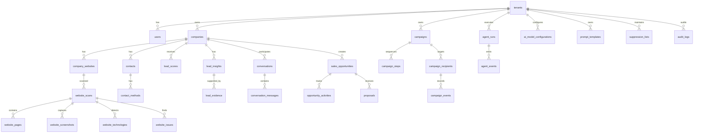

# Database Design

PostgreSQL is authoritative. Use UUID primary keys for tenant-owned/business entities and foreign keys for every relationship. Every tenant-owned row has `tenant_id NOT NULL`, indexed with the access paths used by the API. Enforce same-tenant relationships in application services and, where feasible, composite unique keys/foreign keys such as `(tenant_id, id)` to prevent cross-tenant references even when an identifier is guessed. Global reference/configuration data is explicitly marked and never used to store tenant business content.

## ERD

Campaign, conversation, opportunity, and proposal tables are included in the schema. Campaign/outbound fields and conversation links are activated incrementally; consult each phase-specific architecture note for current workflow behavior and verification boundaries.

## Table responsibilities and key fields

| Table | Tenant scope and key fields |
|---|---|
| `tenants` | Root account: UUID, name, slug, status, settings JSONB, timestamps. |
| `users` | UUID, email unique, password hash, status, timestamps. If users can join multiple tenants, membership belongs in a `tenant_user` pivot with role/status; this is necessary for correct multi-tenancy and is the only additional relationship table. |
| `companies` | Tenant UUID, normalized name/domain, legal/business descriptors, industry, location, source, status; unique `(tenant_id, normalized_domain)` when present. |
| `company_websites` | Tenant/company UUIDs, normalized URL, host, canonical URL, verification status, discovered source; unique tenant/company/URL. |
| `contacts` | Tenant/company UUIDs, name, title, public profile URL, source, captured time, extraction method, confidence. Avoid inferred or fabricated values. |
| `contact_methods` | Tenant/contact UUIDs, type/value, source URL, captured time, method, confidence, verification status; encrypt sensitive values where appropriate. |
| `website_scans` | Tenant/website UUIDs, status, start/end, crawler version, policy/config snapshot, page/depth limits, error summary. |
| `website_pages` | Tenant/scan UUIDs, requested/final/canonical URL, status, content type, title, fetched time, content hash, object key or bounded extracted text, crawl depth, duplicate reference. Raw body should be stored separately in object storage when large. |
| `website_screenshots` | Tenant/scan/page UUIDs, object key, viewport, captured time, content hash, status. |
| `website_technologies` | Tenant/scan UUIDs, technology name/category, detection method, confidence, evidence page. |
| `website_issues` | Tenant/scan UUIDs, type/severity, summary, page reference, evidence JSONB, confidence, detector/version. |
| `lead_scores` | Tenant/company UUIDs, total 0–100, component breakdown JSONB, rule-set version, scored time, agent run UUID. Append score history rather than overwrite. |
| `lead_insights` | Tenant/company UUIDs, kind, statement, confidence, source run, created time. |
| `website_intelligence_results` | Immutable normalized Website Intelligence result per tenant/agent run, including validated evidence references and model/prompt provenance; no raw provider payload. |
| `lead_evidence` | Tenant/insight UUIDs, evidence type, source page/contact/issue reference, excerpt/hash, source URL, observed time, confidence. |
| `campaigns` | Tenant UUID, creator, name/description/objective, status, target audience, timezone, send windows, per-campaign limits, configuration. |
| `campaign_audiences` | Tenant/campaign UUID, named structured targeting criteria; one current audience definition per campaign. |
| `campaign_templates` | Tenant/campaign UUID, channel, subject/body, draft/approval status, version. |
| `campaign_steps` | Tenant/campaign/template UUIDs, ordinal, step type, delay/config, and active flag. |
| `campaign_recipients` | Tenant/campaign/company/contact/contact-method UUIDs, idempotency key, current step, schedule, lifecycle state and stop reason. |
| `campaign_events` | Tenant/campaign/optional enrollment UUID, idempotency key, correlation ID, event type/time, safe metadata; do not include message content or contact secrets. |
| `conversations` | Tenant/company/contact/campaign/optional enrollment UUIDs, AI/human state, intent/confidence, summary, recommendation reason/evidence, handoff owner/reason/timestamp, correlation ID. |
| `outbound_messages` | Tenant/campaign/enrollment/step/contact-method UUIDs, encrypted subject/body, channel/provider state, durable attempt/schedule timestamps, idempotency key, correlation ID and safe failure details. |
| `conversation_messages` | Tenant/conversation/outbound-message UUIDs, direction, encrypted body, delivery state, intent/confidence, evidence refs, timestamps. Legacy body remains readable during compatibility migration. |
| `sales_opportunities` | Tenant/company UUIDs, owner, stage, value/currency, status, qualification metadata. Composite tenant keys prevent cross-tenant company links. |
| `opportunity_activities` | Tenant/opportunity UUID, actor, activity type, safe details, timestamp. |
| `proposals` | Tenant/opportunity UUID, lifecycle state/version, title/summary/terms, immutable calculated totals/discount, validity and approval/delivery timestamps. |
| `tenant_services` | Tenant service catalog with SKU, description, unit price/currency, active state. Proposal prices are copied into item snapshots. |
| `tenant_icp_configurations` | Tenant-scoped versioned ICP JSON dimensions with draft/active/superseded state, author, activation actor/time, and audit history. Active version is used for configured geography and industry scoring; readiness requires an active compatible version. |
| `tenant_pricing_policies` | Tenant currency, maximum discount and default validity. Discount requests above policy are rejected server-side. |
| `proposal_items` | Tenant/proposal/service UUID, service snapshot, quantity, unit price and line total. |
| `proposal_deliveries` | Tenant/proposal/contact method, provider/idempotency state and encrypted subject/body. |
| `meeting_bookings` | Tenant/conversation/provider booking, timezone, start/end, status, idempotency key and actor. |
| `agent_decisions` | Tenant/conversation/company references, action, reason, confidence, evidence IDs, approval state and idempotency key. |
| `tenant_scheduling_configurations` | Tenant scheduling adapter, enabled state, autonomous booking policy and timezone. |
| `agent_runs` | Tenant UUID, agent key/version, status, requested by, input reference/hash, config/prompt versions, start/end, idempotency key, safe error summary. |
| `agent_events` | Tenant/run UUID, sequence, event key, safe payload JSONB, timestamp. Unique `(agent_run_id, sequence)`. |
| `ai_model_configurations` | Tenant UUID (nullable only for system defaults), task key, provider/model, enabled, parameters/limits, secret reference, config version. Never store plaintext provider secrets. |
| `prompt_templates` | Tenant UUID (nullable for system templates), agent/task key, version, template text, schema version, active state. User-managed text must not override system policy. |
| `suppression_lists` | Tenant UUID, keyed identifier hash/type, scope, reason, source, suppression time. Consult before enrollment and every send. |
| `tenant_messaging_configurations` | One tenant sender/provider configuration, limits, enabled flag and secret reference; never store provider credentials. |
| `audit_logs` | Tenant UUID, actor, action, subject type/UUID, request ID, timestamp, redacted change metadata. Append-only to application roles. |

## Modeling and retention decisions

Use `timestamptz`, UTC storage, bounded `jsonb` only for versioned configuration or evidence that is naturally variable. Use relational columns for authorization, filtering, and joins. Avoid polymorphic foreign keys for core relationships; where audit subjects need polymorphism, validate and tenant-check in the writer. Index tenant plus common filters (`status`, `created_at`, `company_id`, `agent_key`). Add partial unique indexes for nullable normalized domains and idempotency keys. Keep snapshots immutable and version scoring rules/prompts/model config so results can be explained later. Define deletion/retention and legal hold behavior before production data ingestion; object keys should be deletable through a durable cleanup job.
