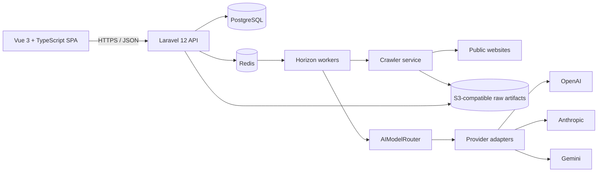

# System Architecture

## Goals and boundaries

Yaandu AI Growth Engine is a tenant-isolated B2B customer acquisition platform. It turns company discovery and public website evidence into reviewable intelligence, scores opportunities, and provides a controlled path to later outreach and sales workflows. It is not a general-purpose scraper. Phase 1 establishes the platform and activates only Discovery, Website Intelligence, and Lead Scoring agents. Marketing, follow-up, sales conversations, proposals, and autonomous orchestration beyond these agents are later phases.

## Runtime topology



The Laravel application is a modular monolith. Domain modules own their application services, policies, models, and jobs while sharing one deployable API and PostgreSQL database. This keeps transactions, authorization, and agent run records straightforward while leaving clear seams for independent scaling later. PostgreSQL is the source of truth; Redis is for queues, locks, rate-limit state, and short-lived cache only. S3-compatible storage holds screenshots and large raw crawl artifacts; relational rows hold searchable metadata and object keys.

## Module structure

Use Laravel conventions with domain-oriented namespaces rather than one generic service folder:

```text
app/
  AI/                 AIProviderInterface, adapters, AIModelRouter, config
  Agents/             AgentInterface, context/result, orchestrator, agent classes
  Tenancy/            tenant resolution, scoped query support
  Identity/           authentication, users, tenant membership
  Companies/          companies, websites, contacts
  Discovery/          source adapters, discovery jobs
  Crawling/           URL policy, robots/sitemap, HTTP fetch, Playwright fallback
  WebsiteIntelligence/ scans, pages, screenshots, technologies, issues, insights
  LeadScoring/        scoring rules, evaluator, score history and evidence
  Audit/              audit records and event handling
  Shared/             identifiers, clocks, safe serialization, domain exceptions
```

Controllers validate/authorize and delegate to application services. Jobs invoke the same services as synchronous callers. Database migrations are grouped by bounded context, with foreign keys and tenant indexes. Vue source should use feature areas (`companies`, `intelligence`, `agents`, `configuration`) and typed API clients; the SPA must not contain business scoring or provider routing logic.

## Request and data flow

1. An authenticated user starts a tenant-scoped discovery search, supplies seed companies, or previews and confirms a CSV/domain import. Discovery persists reviewable candidates before promoting them to companies.
2. Laravel validates the request and creates an `agent_runs` record, then dispatches a queued DiscoveryAgent run.
3. Discovery stores normalized companies and candidate websites with provenance. The crawler applies URL policy and robots/sitemap rules, saves raw response metadata and artifacts, and creates a scan.
4. WebsiteIntelligenceAgent receives bounded, sanitized page evidence. It stores interpretations and issue evidence separately from raw page data.
5. LeadScoringAgent evaluates versioned tenant scoring rules against persisted evidence, records the score and explanation, and emits run events.
6. The dashboard reads tenant-scoped API resources and presents provenance, confidence, and run status for human review.

Agents must be replayable from persisted input references and configuration versions. Agent outputs are validated against schemas before persistence. External calls have bounded timeouts/retries and idempotency keys where practical. Runs expose states `queued`, `running`, `succeeded`, `failed`, and `cancelled`; event rows provide progress and error summaries without secrets.

## API plan

Version routes under `/api/v1`. Use Sanctum with secure session or token configuration appropriate to the deployment; authorize every request through tenant membership policies. Return resource envelopes with stable UUIDs, pagination, and validation errors. Initial endpoints:

| Area | Endpoint examples | Purpose |
|---|---|---|
| Session | `POST /login`, `POST /logout`, `GET /me`, `GET /tenants` | Stateful Sanctum session and active tenant choices (`X-Tenant-ID` selects an active membership) |
| Dashboard | `GET /dashboard/summary` | Tenant-scoped aggregate counts |
| Companies | `GET/POST /companies`, `GET /companies/{id}` | List, manually add, and inspect companies |
| Websites | `POST /websites/{id}/scan`, `GET /website-screenshots/{id}/content` | Queue a bounded scan and retrieve an authorized screenshot |
| Discovery | `POST /discovery-runs`, `GET /agent-runs/{id}` | Queue supplied company seeds and inspect run status |
| Intelligence | `GET /companies/{id}/intelligence` | Pages, issues, technologies, insights, and latest scan |
| Contacts | `GET /contacts` | Public business contacts and provenance (contact methods encrypted at rest) |
| Scores | `GET /lead-scores`, `POST /companies/{id}/score`, `GET/PUT /scoring-rules` | Score history and tenant rules |
| Agents | `GET /agent-runs`, `GET /agent-runs/{id}` | Run history and persisted events |
| AI config | `GET/POST /ai-configurations`, `PUT /ai-configurations/{id}` | Authorized tenant model/task settings; never reveal credentials |

Tenant switching, editable company records, scan-history endpoints, agent cancellation, company-filtered contacts, and SSE updates are planned API extensions, not registered routes today.

Filtering and sorting must be allowlisted. Bulk export, contact outreach, campaign endpoints, sales conversations, and proposal endpoints are outside Phase 1.

## Frontend plan

Vue 3, TypeScript, Vite, and a typed API client. Initial views: Dashboard, Companies, Company Details, Website Intelligence, Contacts, Lead Scores, ICP Configuration, Agent Runs, and AI Configuration. Build shared tenant context, loading/error/empty states, permission-aware navigation, and accessible data tables. Company detail tabs should link evidence to the exact page/source and show capture time and confidence. Use polling or server-sent events for run updates; choose polling for the initial implementation unless deployment supports SSE cleanly.

## Operational requirements

Run API and Horizon workers as separate processes. Define queue names and concurrency per workload. Health endpoints should check application readiness without leaking infrastructure credentials. Centralize structured logs with tenant/run correlation IDs and redact authorization headers, provider keys, cookies, and sensitive contact data. Metrics should cover queue age, run outcome/duration, crawler status classes, provider latency, and rate-limit responses. Configure retention for raw page data, screenshots, and audit records based on deployment policy.
